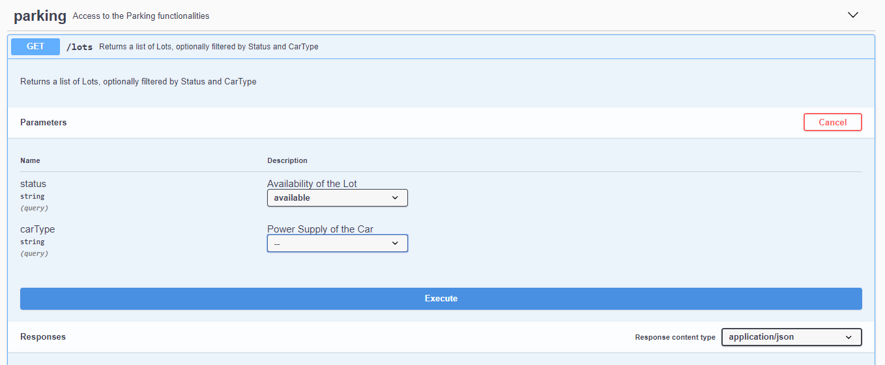
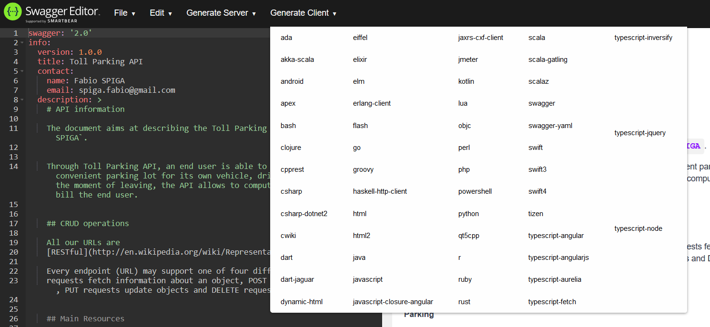

# Toll Parking API

The document aims at describing the Toll Parking API create by `Fabio SPIGA`.

Through Toll Parking API, an end user can search for the most convenient parking lot for its own car, drive to it and park. 
At the moment of leaving, the API allows to compute the amount to pay and provide a bill to the user.

Toll Parking API is RESTful and based on `OpenAPI Specification` (OAS): it uses `Swagger` tools to generate and visualize API documentation 
so it can be easily understood and used.

You can learn more about *why* using OpenAPI/Swagger from here: [https://swagger.io/docs/specification/about/](https://swagger.io/docs/specification/about/)


## Getting Started

These instructions will get you a copy of the project up and running on your local machine for development and testing purposes.


## Prerequisites
Make sure you have installed all of the following prerequisites on your development machine:
* Git - [Download & Install Git](https://git-scm.com/downloads)
* Java JDK 8 - [Download & Install JDK](https://www.oracle.com/technetwork/java/javaee/downloads/index.html)
* Maven - [Download & Install Maven](https://maven.apache.org/download.cgi)


## Downloading Toll Parking API

There are several ways you can get Toll Parking API installed:

### Cloning The GitHub Repository
The recommended way to get the Toll Parking project is to use git to directly clone the repository:

```bash
$ git clone https://github.com/spaiga/toll-parking.git toll-parking
```

This will clone the latest version of the toll-parking repository to a **toll-parking** folder.

### Downloading The Repository Zip File
Another way to get the Toll Parking project is to download a zip copy from the [master branch on GitHub](https://github.com/spaiga/toll-parking/archive/master.zip). You can also do this using the `wget` command:

```bash
$ wget https://github.com/spaiga/toll-parking/archive/master.zip -O toll-parking.zip; unzip toll-parking.zip; rm toll-parking.zip
```


## Running Toll Parking API

The Toll Parking API Server is generated by the [swagger-codegen](https://github.com/swagger-api/swagger-codegen) project, by using the 
**OpenAPI-Spec** defined in [jaxrs-server/src/main/webapp/toll-parking-api-spec/toll_parking_api.yml](jaxrs-server/src/main/webapp/toll-parking-api-spec/toll_parking_api.yml) .  

In this example, the server uses the [JAX-RS](https://jax-rs-spec.java.net/) framework.

As a general rule, what is under the package `io.swagger` comes from the generated code, whereas the package `com.spiga` is written manually.

To run the server, please open a shell in the `toll-parking\jaxrs-server` folder and execute the following:

```
mvn clean package jetty:run
```

You can then view the swagger listing here:

[http://localhost:8080/api/swagger.json](http://localhost:8080/api/swagger.json)

The **API Documentation** is available here:

[http://localhost:8080/toll-parking-api-spec/](http://localhost:8080/toll-parking-api-spec/)


## Interacting with Toll Parking API

The server comes with a prefilled configuration (stored in-memory, as example) of:
* 12 parking lots (mixed gasoline, 20kw and 50kw for electric cars);
* 2 pricing policies (one linear and one with an additional fixed cost).

Several ways are available to interact with the server, as described hereafter.

### Using the API Documentation

The [API Documentation](http://localhost:8080/toll-parking-api-spec/) also allows to interact with the API.

Clicking on each method, you will have the possibility to *Try it out* that method, directly from the web page:




### Using CURL

[curl](https://curl.haxx.se/) is another way to interact with the API.
As an example, you can get all the *available* lots using the following message:
```
curl -X GET "http://localhost:8080/api/lots?status=available" -H  "accept: application/json"
```

### Using the Java Client

The Toll Parking API Client is a simple Java client generated by the [swagger-codegen](https://github.com/swagger-api/swagger-codegen) project.

As a general rule, what is under the package `io.swagger` comes from the generated code, whereas the package `com.spiga` is written manually.

To compile the API client library and install it to your local Maven repository, simply go to the `toll-parking\java-client` folder and execute:

```shell
mvn clean install
```

PS: if you experience any problem with the *maven-enforcer-plugin* (that forces the Maven version to 2.2.0), you can comment it out from the `pom.xml`.

More details about the Client [here](java-client/README.md).

**Unit Tests**

The Java Client is provided with a JUnit class (`java-client\src\test\java\com\spiga\api\client\TestParkingApi.java`) that tests a complete flow, 
in addition to the automatically genered unit tests. This is particularly useful to automatically test the main flow and avoid to break it when developing.


## Generating Clients
You can automatically generate other clients in many different format simply by using [Swagger Codegen](https://github.com/swagger-api/swagger-codegen).

Even easier, you can import the file: 
```
jaxrs-server\src\main\webapp\toll-parking-api-spec\toll_parking_api.yml
```
into [Swagger Editor](http://editor.swagger.io/)
and click on `Generate Client`:



## Limitations

* The input parameter validation is not performed carefully in the API methods; a next version will improve this aspect to make the API more robust.
* Security scheme for authentication and authorization are not implemented; a next version will add a secure access to the API.